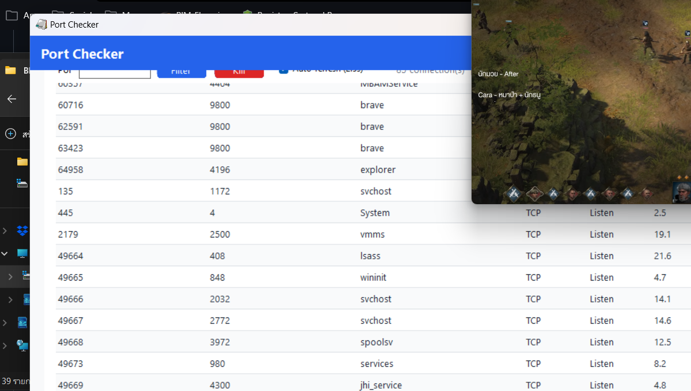

<div align="center">
  <h1>🔌 Port Checker</h1>
  <p><strong>See who's using your ports — kill them if you want</strong></p>

  
  
  
  
  
</div>

<br />

<p align="center">
  
  <br />
  <em>Modern GUI — filter, sort, kill at a glance</em>
</p>

---

## ✨ Features

| Feature | Description |
|---------|-------------|
| **📋 Port List** | Shows all TCP & UDP listening ports |
| **🔍 Filter** | Type a port number to focus on one service |
| **📊 Resources** | Real-time **Memory (MB)** and **CPU %** per process |
| **📍 Path** | Know exactly which executable is listening |
| **💀 Kill** | Select a row and kill the process instantly |
| **🔄 Auto-refresh** | Updates every 2.5 seconds — toggle on/off |
| **↕️ Sort** | Click any column header to sort |

## 🚀 Usage

```
port-check.exe
```

A GUI window opens. No installation required. No dependencies.

### Quick tips

| Action | How |
|--------|-----|
| Filter by port | Type port number → press **Enter** or click **Filter** |
| Refresh manually | Click **Refresh** |
| Kill a process | Select row → click **Kill** |
| Toggle auto-refresh | Check/uncheck **Auto-refresh (2.5s)** |
| Sort table | Click any column header |

### Example

```
> port-check.exe
```

1. Type `3000` in the Port field → shows only processes on port 3000
2. See **PID**, **Mem (MB)**, **CPU %**, and **Path**
3. Click **Kill** to terminate the process

## 🛠️ Build from source

Requires .NET Framework 4.8+ and the C# compiler (`csc.exe`).

```powershell
csc.exe /target:winexe /reference:System.Windows.Forms.dll /reference:System.Drawing.dll /reference:System.Management.dll port-check.cs
```

## 📦 Download

[Download latest release](https://github.com/ChokechaiXD/port-check/releases) — just `port-check.exe`, no installer.

## 📄 License

MIT
